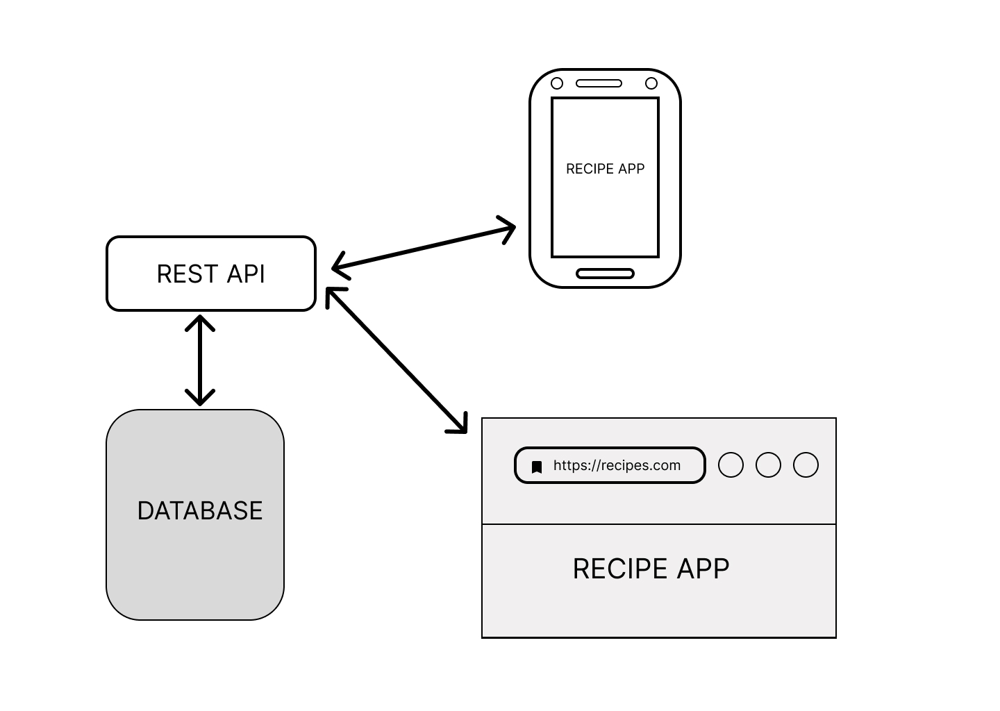

# recipe-app-with-django-rest-api-and-docker

Building a recipe app with Django Rest-API and Docker

**  Features:

* 19 API Endpoints
* User Authentication
* Browseable Admin Interface (Django Admin)
* Browseable API(Swagger)

**Here is an image demonstrating the workflow:

**  Technologies:

* Python
* Django Rest API
* PostgreSQL > store our Data
* Docker > Development Environment and Deployment
* Swagger > Automated documentation of our API and for our browseable API
* Github Actions > automation, testing and linting,
  
** Project Structure

* App/ - Django project
* App/core / - Code shared between multiple apps
* App/user/ - User Related Code
* App/recipe/ - Recipe Related Code

** Test Driven Development Flow:

